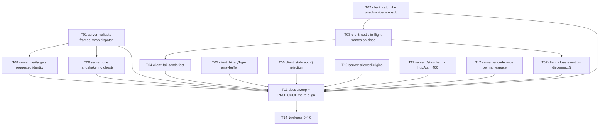

<!--
GENERATED ANALYSIS — @marianmeres/ws
Produced 2026-09-04 by an inline single-agent review: every source, test and doc file read;
each bug reproduced with a script against the real server; every file:line re-opened before
writing. Claims verified against the codebase at commit db21ff3. Planning artifact; no code
was changed.
-->

# @marianmeres/ws — Hardening Overview & Roadmap

> **Overall health: a sound design with two crashers and a short tail of "the promise
> lies".** The reconnect machinery, the outbox, the heartbeat and the re-subscribe-then-
> flush ordering are correct and are the parts the resilience tests protect. All 39 tests
> pass; lint, fmt, type check, doc lint and the publish dry run are clean. Nothing in this
> plan touches the architecture. Every finding below was **reproduced** with a script
> against the real server before it was written down; none is a reading of the code
> alone.
>
> **The two things that matter most.** First, any connected client can kill the reference
> server with one frame: a `sub` whose `rooms` is not an array throws inside a `void`ed
> async handler, and Deno exits on the unhandled rejection
> ([`01-server.md`](./01-server.md) #1). Second, the README's own teardown sequence,
> `unsub(); ws.dispose();`, produces an unhandled `WSDisposedError` that exits a Deno or
> Node process ([`02-client.md`](./02-client.md) #1). Both fixes are small; both need a
> regression test that exercises the exact sequence, because the current suite never
> does.
>
> **The third thing: trust boundaries the docs promise and the code does not keep.**
> Namespace isolation depends on the `verify` hook returning a namespace, yet the hook
> cannot see what the client requested and the client's request is honoured by default
> ([`01-server.md`](./01-server.md) #2). An unguarded `/stats` lists every connected
> tenant by name while three places claim it exposes "counts only"
> ([`01-server.md`](./01-server.md) #5). Nothing checks `Origin` although `verify` is
> handed the request so cookies can be used ([`01-server.md`](./01-server.md) #4). Each is
> a surgical change plus a documentation correction, and each is a behaviour a consumer
> would reasonably assume already exists.
>
> **The fourth: promises that wait for a timer to say what the client already knows.** A
> publish in flight when the socket drops, a publish after a terminal close, a payload
> that cannot be serialized — all three hang for the full `sendTimeout` and then report a
> generic timeout. The worst case is a `subscribe()` whose ack was lost to the drop: it
> rejects 30 s later and **detaches its handler** after the reconnect has already
> re-established the room ([`02-client.md`](./02-client.md) #2, #3).
>
> **How to read `docs/hardening/`.** This document is the map. [`01-server.md`](./01-server.md)
> and [`02-client.md`](./02-client.md) hold the findings with evidence, the proposed change
> and a **Done when** line each; [`03-docs-and-release.md`](./03-docs-and-release.md) is
> the residue of documentation drift that no code task owns, plus the release.
> [`PROGRESS.md`](./PROGRESS.md) is the tracker: one sprint, fourteen rows, the last one
> human-only. The decisions every task needed have been taken with the planner's defaults
> and recorded there; change any of them before running, not during.

---

## Top recommendations across all dimensions (ranked)

Ranked by value for a public package that promises to "survive real networks", then by
effort. Effort: S = small, M = medium.

| Rank | Recommendation                                                              | Dimension (doc)                          | Value | Effort | Risk | Why now                                                                                                                  |
| ---- | --------------------------------------------------------------------------- | ---------------------------------------- | ----- | ------ | ---- | ------------------------------------------------------------------------------------------------------------------------ |
| 1    | Validate frame shapes; never let a handler throw escape the socket callback | server ([01](./01-server.md) #1)         | high  | S      | low  | Remote DoS by one frame, no credentials needed without `verify`. Reproduced: process exit 1.                             |
| 2    | Catch the unsubscriber's fire-and-forget `unsub`                            | client ([02](./02-client.md) #1)         | high  | S      | low  | The README's own `unsub(); ws.dispose();` exits Deno and Node. Ten lines and a test.                                     |
| 3    | Hand `verify` the client's requested identity; document the isolation rule  | server ([01](./01-server.md) #2)         | high  | S      | low  | The multi-tenant boundary is silently client-controlled unless the app remembers to override it. Additive, non-breaking. |
| 4    | Settle in-flight frames the moment the socket closes                        | client ([02](./02-client.md) #2)         | high  | M      | med  | A lost `sub` ack detaches a working subscription 30 s later; in-flight publishes wait for an ack that cannot come.       |
| 5    | Receive binary frames as `ArrayBuffer`                                      | client ([02](./02-client.md) #4)         | med   | S      | low  | One line makes the documented `WSDecoder` contract and the binary-codec seam true.                                       |
| 6    | A stale `auth()` rejection must not close a newer socket                    | client ([02](./02-client.md) #5)         | med   | S      | low  | Generation check is on the wrong side of the catch; reproduced killing a healthy socket.                                 |
| 7    | Fail sends fast when the outcome is already known                           | client ([02](./02-client.md) #3)         | med   | S      | low  | Terminated state and encode errors both masquerade as timeouts after 30 s.                                               |
| 8    | Emit `close` on a local `disconnect()`, retire the dead `#intentional`      | client ([02](./02-client.md) #6)         | med   | S      | low  | The event doc, the `4900` code and the flag all describe an intent the code never reaches.                               |
| 9    | One handshake per socket; no ghost registration after a mid-verify close    | server ([01](./01-server.md) #3)         | med   | S      | low  | Double `verify` and a permanent ghost with `idleTimeout: 0`; both reproduced.                                            |
| 10   | Opt-in `allowedOrigins` check on the upgrade                                | server ([01](./01-server.md) #4)         | med   | S      | low  | Cookie-based `verify` is invited by the docs and is hijackable cross-site without it. Unset keeps today's behaviour.     |
| 11   | Mount `/stats` only behind `httpAuth`; answer bad JSON with 400             | server ([01](./01-server.md) #5)         | med   | S      | low  | Tenant names leak from an unguarded route that claims "counts only". One rule for the whole HTTP surface.                |
| 12   | Encode a fan-out frame once per namespace                                   | server ([01](./01-server.md) #6)         | med   | S      | low  | N serializations of one payload per publish, on the hottest path there is.                                               |
| 13   | Sweep the remaining doc drift and re-align `PROTOCOL.md`                    | docs ([03](./03-docs-and-release.md) #1) | med   | S      | low  | The residue after every code task has updated the docs it touched.                                                       |
| 14   | Release 0.4.0 — human-only                                                  | docs ([03](./03-docs-and-release.md) #2) | high  | S      | low  | Behaviour changes and new API; irreversible and outward-facing, so not the machine's.                                    |

**Deliberately omitted** (low value, or not this package's problem): synthesizing a local
presence `sync` for a late presence handler on an already-presence-enabled room; per-IP
connection caps on a reference server; `maxFrameSize` counting UTF-16 units instead of
bytes; a guard on `handleUpgrade()` after `close()`; the stale gitignored `.npm-dist/`
(the publish task rebuilds it); client-side validation of server frame shapes. Each is
noted as "Cut from the draft" in its dimension doc with the reason.

---

## The sprint

Everything above is one sprint on one branch, `sprint/hardening`, in the row order of
[`PROGRESS.md`](./PROGRESS.md). The order is not the rank: it follows the dependency
graph below and keeps the two client edits that touch the same functions adjacent.

**Crashers first, alone.** T01 (server input validation) and T02 (the unsubscriber catch)
are each a small diff with a test that reproduces a process exit. They go first because
they are the only findings that can be triggered today by a single line of user or
attacker code, and because T02 must land before T03 makes in-flight unsubs reject
immediately, which would otherwise fire the uncaught promise far more often.

**Then the trust boundary.** T08 gives `verify` the requested identity and writes the
isolation rule into `API.md` and the README. It depends only on T01's string validation
and is the highest-value server change after the crash fix.

**Then the client's promise semantics, in dependency order.** T03 is the one medium-effort
task: a new `WSConnectionLostError`, an `Outbox.settleInFlight`, and the call from
`#onClose` and `disconnect()`. T04 (fail fast on terminated state and encode errors) and
T07 (`close` on `disconnect()`) build on it and edit the same functions, so they follow
directly. T05 (`binaryType`) and T06 (auth-rejection race) are independent one-liners with
a test each and sit between them so the client work is contiguous.

**Then the rest of the server.** T09 (handshake serialization), T10 (`allowedOrigins`),
T11 (`/stats` gating and 400) and T12 (encode once) are independent small changes; T09
depends on T01 only because both edit `#onAuth`.

**Docs, then the handover.** T13 sweeps what no code task owned and re-reads `PROTOCOL.md`
against the final code. T14 is `🔒`: the release is a human's to make, and the sprint is
designed to end with "your turn" rather than "complete".

---

## Cross-cutting themes

- **A promise nobody holds.** The unsubscriber's discarded `#sendControl` (T02), the
  `void`ed `#onMessage` on the server (T01), and in-flight frames left pending across a
  close (T03) are the same mistake three times: an async result with no owner. The fix is
  the same each time — decide at creation who settles it and how — and `AGENTS.md` gets
  the convention so it does not come back.
- **Answers that are already known should not wait for a timer.** A closed socket (T03),
  a terminated client (T04) and a failing encoder (T04) each know the outcome at once;
  the timer exists for the unknown case. Every place that waited has a reproduction
  showing a 30 s hang followed by a misleading `WSTimeoutError`.
- **Trust the shape of nothing that crossed the wire.** T01 on the server and T05 on the
  client are both about an input whose type was assumed. The Python reference already
  validates what the Deno server does not; the sprint aligns the two.
- **Docs that promise more safety than the code delivers.** "Counts only, never client
  ids" (T11), "the client's default decoder also accepts binary frames" (T05), and the
  `verify` hook documented without the rule that makes namespaces safe (T08). Each is
  fixed in the commit that changes the behaviour, so the two cannot drift apart again.

---

## Dependency / sequencing notes

Every edge is mirrored in the `Deps` column of [`PROGRESS.md`](./PROGRESS.md); that column
is what holds the order, this graph is for the reader.

---

## Completeness check

- The server doc found the crash by reading `#onSub`; the client doc's binary finding
  then prompted the same experiment against the server, which showed the Deno server side
  already defaults to `arraybuffer` — so no server task was needed for binary input and
  none is listed. Checked, not assumed.
- The client's "settle on close" (T03) makes the unsubscriber's dropped promise (T02)
  reject far more often; the dependency is recorded so the sprint cannot land them in the
  wrong order.
- `PROTOCOL.md` §7 already specifies `bad_request` for a missing `room`, and the Python
  reference implements it; T01 brings the Deno server up to the spec it ships rather than
  changing the spec. The only spec additions are the non-array `rooms` answer and the
  `allowedOrigins`/`/stats` notes in §10, owned by T13.
- Not examined: the example app's client under a real browser, and the npm build under
  Node. Neither is changed by the sprint beyond the client fixes, which the Deno tests
  cover; T14's release note should still say the client behaviour changed.

Source documents: [`01-server.md`](./01-server.md), [`02-client.md`](./02-client.md),
[`03-docs-and-release.md`](./03-docs-and-release.md).
